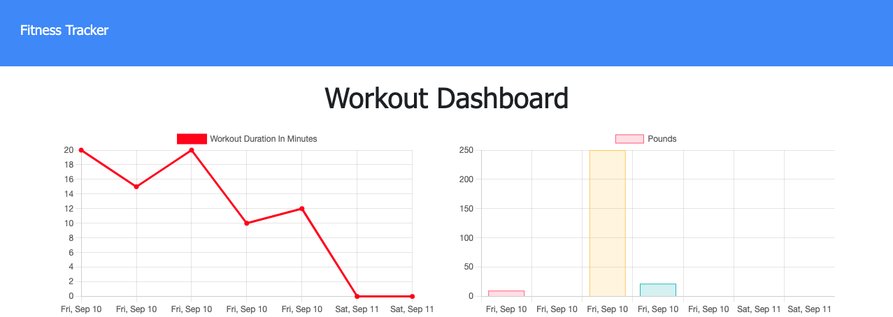

# the wisdom to know the difference

[Live Demo](https://pure-anchorage-61730.herokuapp.com/?id=613cf1d4e203bb00161e5e45)

## Table of Contents

- [Description](#description)
- [Technologies](#technologies)
- [Installation](#installation)
- [License](#license)
- [Contact](#contact)

## Description

This project tasked the developer with creating nosql database models and RESTful routes to support functionality of a pre built front end. Beyond gaining practical experience with Mongoose and mongoDB, this project taught me to conciser the design of an application's interface when choosing and setting up a database.

## Technologies

- [node.js](https://nodejs.org/en/)
- [express](https://www.npmjs.com/package/express)
- [mongoDB](https://www.mongodb.com/)
- [Mongoose](https://www.npmjs.com/package/mongoose)
- [morgan](https://www.npmjs.com/package/morgan)
- [dotenv](https://www.npmjs.com/package/dotenv)

## Installation

to use this project as a basis for further development, clone this repo and open it in a Node.js runtime environment and run `npm install` to install all required dependencies. Create a mongoDB Atlas cluster. Delete the .EXAMPLE form the included .env.EXAMPLE file and update with the connection string for the mongoDB Atlas cluster. The command `npm start` will start the server on port 3103.

## License

This project (and all code) is licensed under the [MIT license](https://opensource.org/licenses/MIT).

## Contact

If you have any questions feel free to reach out by [email](mailto:sissyhanks@yahoo.com) or visit my [personal website](https://github.com/sissyhanks).
